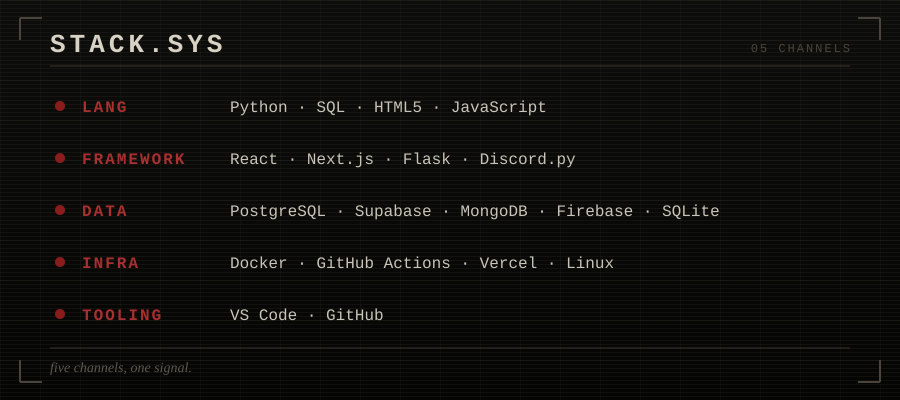
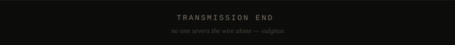

<div align="center">



<a href="https://readme-typing-svg.demolab.com">
  
</a>

</div>

<br>

<table width="100%">
<tr>
<td width="70%" valign="top">

### :: SIGNAL

16. India. No formal team, no office — just a room, a terminal, and whatever's rendering at 3am.

I build things that shouldn't quite work: ambient AI companions that live inside a container, a desktop environment modeled after a fictional supercomputer, a Discord bot with an economy nobody asked for. Most of it starts as a bit and doesn't stop until it's load-bearing.

`currently online:` custom Linux desktop environments · Discord bot architecture · local/ambient AI tooling · web dev

`currently studying:` LLM integration patterns, neural nets, deeper Python

`will talk for hours about:` ricing i3, building agents that remember things, why the terminal is still the best interface

</td>
<td width="30%" valign="top">

### :: STATUS

```
UPTIME    ok
MEMORY    persistent
SIGNAL    stable
MODE      building
```

</td>
</tr>
</table>

<br>

<p align="center"></p>

### :: SIGNAL LOG

<table width="100%">
<tr>
<td width="45%" valign="top">

<a href="https://github.com/vulgnox/eva-shell">
  
</a>

A fully working i3wm environment built around NERV's MAGI supercomputer — three panels standing in for MELCHIOR, BALTHASAR, and CASPAR. MELCHIOR runs a local LLM for live system analysis; the other two watch memory, storage, temp, and network. Not a wallpaper. An actual daily driver.

</td>
<td width="55%" valign="top">

**Evangelion Discord bots** — companion project to eva-shell. Character bots that sit in-server and stay in character.

| UNIT | DESIGNATION | STATUS |
|:---:|:---|:---|
| 01 | Shinji | deployed |
| 02 | Asuka | deployed |
| 00 | Rei | deployed |

Built to make the desktop environment feel less like a theme and more like a system that's actually inhabited.

</td>
</tr>
</table>

<details>
<summary><b>:: OTHER TRANSMISSIONS</b></summary>
<br>

- **OpenHuman** — an ambient, always-on AI companion running in a Linux container. The long-term goal: a living, Jarvis-style system instead of a chatbot you open and close.
- **Blood & Coin** — a Discord RPG set in the fictional city of Valdris. Duels, bounties, faction war, a full economy nobody sane would maintain by hand.
- **Kode Nexus** — a team-built educational quiz platform, backend and grading logic handled end to end.

</details>

<br>

<p align="center"></p>

### :: STACK

<p align="center">

</p>

<p align="center"></p>

### :: TELEMETRY

<sub>if these look empty, the shared instance is rate-limited — see the self-host note below</sub>

<p align="center">


</p>

<p align="center">

</p>

<p align="center">

</p>

<p align="center">
<picture>
  <source media="(prefers-color-scheme: dark)" srcset="https://raw.githubusercontent.com/vulgnox/vulgnox/output/snake-dark.svg" />
  
</picture>
</p>

<br>

<p align="center"></p>

### :: FREQUENCIES

<p align="center">
<a href="https://instagram.com/vulgnox"></a>
<a href="https://pinterest.com/vulgnox"></a>
<a href="mailto:singhrawargaurav367@gmail.com"></a>
</p>

<div align="center">
<sub>

</sub>
</div>

<br>

<p align="center"></p>
